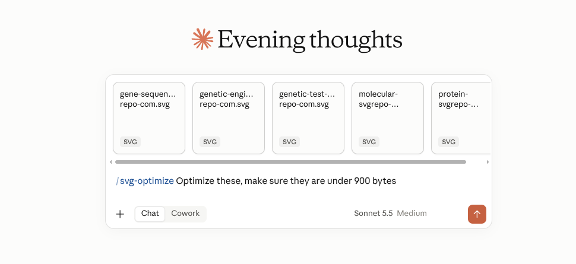
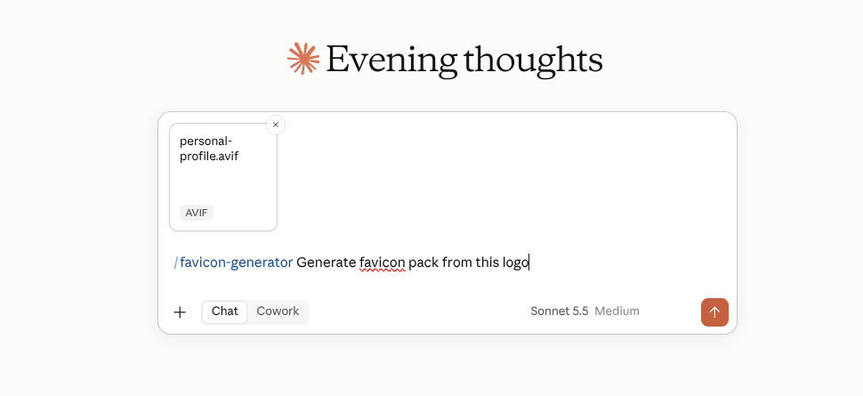
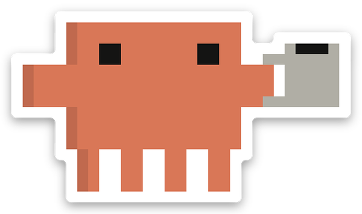

<h1 align="center">
   Claude Toolkit
</h1>

<p align="center">
  My personal skill stack for Claude. Small, reusable skills built from tasks I kept repeating in chat, so I never have to re-explain the same workflow twice.
</p>

---

## Skills

### `/svg-optimize`

Drop an SVG in chat and get a smaller one back that still looks identical.



- Runs SVGO in multipass mode, strips metadata and comments, keeps the `viewBox`
- Renders the result and compares it to the original before delivering
- Honest about size targets. If a target can't be hit without hurting the design, it says so

---

### `/favicon-generator`

One logo in, a complete icon set out.



- Accepts SVG, PNG, JPG, or WebP
- Outputs a multi-resolution `favicon.ico`, PNGs from 16 to 512, an Apple touch icon, and Android Chrome icons
- Includes the ready-to-paste `<head>` snippet

---

### `/optimize-images`

Point it at a project and it shrinks every raster image without visible quality loss.


- Converts to WebP and rewrites the references in your code
- Skips SVGs, animated GIFs, existing WebP and AVIF, and anything that wouldn't get smaller
- Generates tiny base64 blur placeholders for smooth blur-up loading
- Works with Next.js, React, Vue, Svelte, and plain static HTML

---

## Install

Each skill is a folder with a `SKILL.md` and its scripts. To use one, pack it and upload it to Claude.

```powershell
powershell -ExecutionPolicy Bypass -File package-skills.ps1
```

This builds an upload-ready `.skill` file for every skill into `dist`. Re-run it after any change.

Then in Claude, go to **Skills**, choose **Create skill**, and upload the file.

## Project structure

```
skills
  svg-optimize
  favicon-generator
  optimize-images
media
dist
package-skills.ps1
```

## Good to know

- `/svg-optimize` and `/favicon-generator` expect files dropped in chat and keep your original filenames on delivery
- `/optimize-images` bundles its own `sharp`, so it never adds a dependency to your project

<h1 align="center">
   Make sure to star this repo =)
</h1>
